# UML Style Template

Канон оформления UML в проекте (унифицирован с `transform/enricher/*`).

## Общие правила

1. Шрифт: `Arial`
2. Линии: `ortho`
3. Фон диаграммы: `white`
4. Для class/activity/component блоков используем:
- `BackgroundColor #f7e9dc`
- `BorderColor #d9c2a8`
5. В диаграммах классов:
- `set namespaceSeparator none`
- только существенные поля/методы (без перегруза деталями)
6. В sequence:
- `ArrowColor #4b5563`
- `LifeLineBorderColor #9ca3af`

## Шаблоны

### 1. Class

### 2. Sequence

### 3. Activity

```plantuml
@startuml
title <Title>
skinparam backgroundColor white
skinparam linetype ortho
skinparam defaultFontName Arial
skinparam activity {
  BackgroundColor #f7e9dc
  BorderColor #d9c2a8
}

start
' flow...
stop

@enduml
```

### 4. Component/Boundary

```plantuml
@startuml
title <Title>
left to right direction
skinparam backgroundColor white
skinparam componentStyle rectangle
skinparam defaultFontName Arial
skinparam linetype ortho
skinparam component {
  BackgroundColor #f7e9dc
  BorderColor #d9c2a8
}

' components...

@enduml
```

## Подход к содержимому

1. Одна диаграмма = один аспект (классы или последовательность или активность и т.д.).
2. В class-диаграммах включать только методы/поля, важные для конкретной логики.
3. Точки интеграции между слоями помечать явно (например, notes/стереотипами), но не раскрывать лишние внутренности.
4. Сначала `*.puml`, затем экспорт `*.png` с тем же именем.
